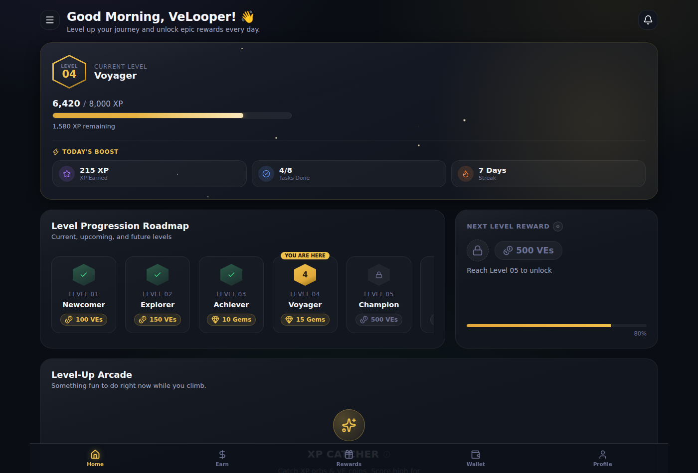
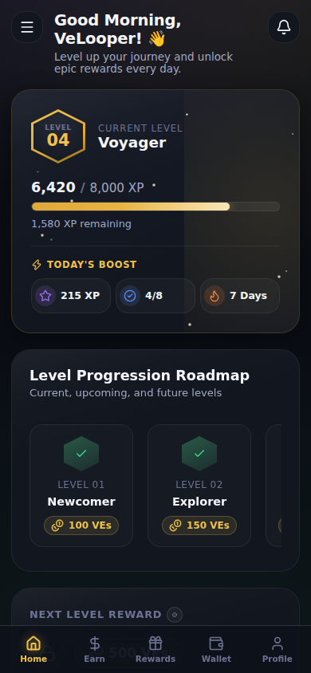
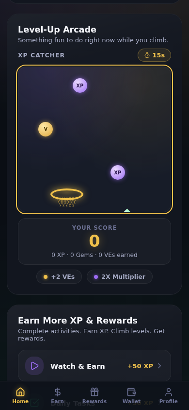
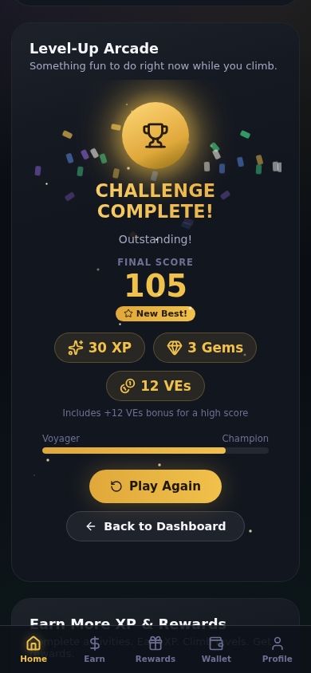
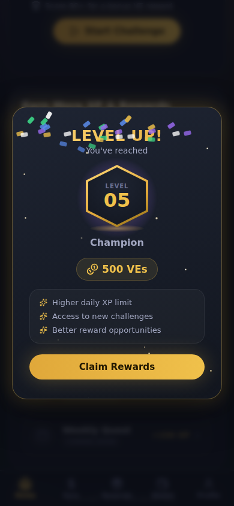

# VELOOP Rewards — Level-Up Dashboard

A complete redesign of the VELOOP Rewards "Level-Up Dashboard" — the screen
where users track their level, XP progress, and rewards inside the VELOOP
"watch ads & earn" app. Built as **Task 16** of a frontend development
internship at VELOOP Rewards.

**Live demo:** https://veloop-rewards-level-dashboard.vercel.app
**Repository:** https://github.com/gagannn19/VELoop-Rewards-Level-Dashboard

---

## 1. Project Overview

The existing Level Dashboard (live at VELOOP's production app) only shows a
level badge, an XP bar, and a list of already-completed levels — there's no
sense of what's coming next, no reason to come back other than watching ads,
and the one mini-game it has is a single-item coin-catcher.

This redesign keeps the same core job (show level + XP, let users earn more)
but rebuilds it around three ideas:

1. **Show the whole journey, not just the past.** The roadmap now shows
   completed, current, and upcoming levels — with locked levels visibly
   locked — so there's always a reason to look ahead.
2. **Make earning feel active, not just passive ad-watching.** A short,
   genuinely playable mini-game (XP Catcher) sits alongside the ad/task/
   referral earning options, with a "Coming Soon" section for features not
   live yet.
3. **Premium gamified-rewards look, not casino/gaming look.** A near-black
   background with layered gold, purple, and green glow accents — rounded
   cards, soft shadows, restrained motion — closer to a polished rewards app
   than a slot machine, even though the palette itself is bolder than a
   typical fintech app.

The dashboard also now reads as a small **app shell**, not just a single
card stack: a top bar with a time-of-day greeting and a notification bell,
plus a bottom tab bar (Home / Earn / Rewards / Wallet / Profile) for
getting around.

This is a single-page application: every screen in the design brief
(dashboard, play & earn, game, game result, level-up celebration, recent
activity) is a **state within one page**, not a separate route. The top bar
and bottom nav don't introduce new routes either — "Home" / "Earn" /
"Rewards" smooth-scroll to sections of the same page, and "Wallet" /
"Profile" (not yet built) show a short "coming soon" toast instead of
navigating anywhere. The existing production dashboard works the same
way — the browser URL never changes between its game/activity views — so
this follows the same pattern rather than introducing routing that nothing
in the app actually needs.

All data on screen is **dummy/development data** (see `src/data/levelData.js`).
It's shaped the way a real API response would be, so swapping in a real
backend later means changing `src/hooks/useLevelData.js` — no component
needs to change.

---

## 2. Level & XP System

- The user has a **current level**, a **level name** (Newcomer → Explorer →
  Achiever → Voyager → Champion → Elite → Master → Legend), a **current XP**
  total, and the **XP required** to reach the next level.
- The hero card shows the level badge, an animated XP progress bar, and a
  **Today's Boost** row (XP earned today, tasks done, current streak).
- The **Level Progression Roadmap** shows every level with one of three
  states: **completed** (green, checkmark), **current** (gold, "You are
  here" tag), or **locked** (grey, lock icon) — future levels are visibly
  there, just not reachable yet.
- The **Next Level Reward** panel shows the reward for the next level behind
  a lock icon, with its own mini progress bar toward that unlock, and doubles
  as the destination for "View Rewards" (Rewards Showcase card, bottom-nav
  "Rewards" tab).
- The top bar's **notification bell** mirrors the most recent activity
  (anything logged "Just now") so a reward earned via a quick-earn tile or a
  finished game is visible from anywhere on the page, not only in the
  Recent Activity list at the bottom.

**XP progression rule:** whenever XP is added (from a quick-earn action or a
finished game), if the new total crosses the required threshold, the user
levels up. The **overflow XP carries into the new level** — it's never
discarded or reset to 0 — the level number and level name update, the XP
requirement for the *next* level increases by a fixed step, and a **Level-Up
celebration modal** appears showing the new level, its reward(s), and a short
list of perks unlocked.

---

## 3. Game Concept & Rules — "XP Catcher"

The brief requires a genuinely functional mini-game (not a static image), and
explicitly requires it **not** be a copy of the site's existing "VE Coin
Catch" game (a shopping basket catching a single type of falling coin). XP
Catcher is a different game built around three ideas the original doesn't
have: multiple item types, a scoring difference between them, and a
multiplier.

**How to play:**

- Move a **golden hoop** (styled like a net, not a basket) left and right
  (drag/click, touch, or Arrow Left / Arrow Right) to catch items falling
  from the top of the play area.
- Three item types fall, each worth something different and visually
  distinct — **purple orbs** (XP), **green diamonds** (Gems, the highest
  value), and **gold coins** (VEs, VELOOP's in-app currency):
  - **XP orbs** — score + XP
  - **Gems** — highest score, plus XP and Gems
  - **VE coins** — score + VEs
- Each catch has a small (~12%) chance of a **2x multiplier**, doubling
  whatever that catch was worth. A legend below the arena reminds players of
  the VE value and multiplier chance while they play, alongside a live score
  panel (current score, plus a running XP/Gems/VEs caption).
- The round lasts **18 seconds**, counted down in a pill-style timer that
  turns red in the final seconds.
- When the round ends, the **Challenge Complete** screen shows a gold trophy
  badge with a confetti burst, the final score (with a **"New Best!"** tag
  if this run beat the previous high score this session), a reward breakdown
  (XP/Gems/VEs earned — a game-result VE bonus is merged into the same VEs
  chip as coin VEs rather than shown twice), and — if the score crosses the
  bonus threshold (80) — a note that a bonus was included.
- Rewards earned in the game are added to the dashboard's real XP/level
  progress immediately (including triggering a level-up if the XP crosses
  the threshold), and are logged in Recent XP Activity.
- **Play Again** starts a new round; **Back to Dashboard** returns to the top
  of the page.

Game state (score, item positions, timer) is fully local to the game and is
thrown away when the game closes — only the final result (XP/Gems/VEs
earned) is reported back to the dashboard. See [Component
Architecture](#5-component-architecture) below.

---

## 4. Earning Features

The **Earn More XP & Rewards** section lists every way to gain XP as a set of
horizontal rows (icon, title + description, XP value, chevron) rather than a
tile grid — each row's icon carries its own accent color (purple, green,
blue, orange, or muted for not-yet-live rows) so the list reads clearly even
at a glance:

| Feature | Reward | Status |
|---|---|---|
| Watch & Earn | +50 XP | Live |
| Daily Tasks | +30 XP | Live |
| Refer & Earn | +100 XP | Live |
| Mini Games (XP Catcher) | +25 XP | Live — scrolls to the game rather than instantly awarding XP |
| Streak Bonus | +25 XP | Live |
| Reward Hunt | +40 XP | Coming Soon |
| Weekly Quest | +150 XP | Coming Soon |

"Coming Soon" rows are visibly disabled and carry a small badge next to the
title — they exist in the design so the layout doesn't need to change when
those features ship for real, but they don't do anything yet, on purpose.

Beneath the earning list, a **Rewards Showcase** card highlights the current
level's reward with a glowing gift-icon badge and a "View Rewards" button
that scrolls to the Next Level Reward panel — giving rewards their own
visible destination, matching the bottom nav's "Rewards" tab.

Every completed earning action (a quick-earn click or a finished game) is
logged in **Recent XP Activity**. Each row picks an icon and accent color
based on what kind of activity it was (referral, task, game, streak, etc.),
and a **Today's Summary** footer shows two stat chips — today's XP total and
today's VEs total — computed from the activity log.

---

## 5. Component Architecture

Single route, no client-side routing — every screen is a component state
inside `LevelDashboard`.

```
src/
  pages/LevelDashboard/
    LevelDashboard.jsx        # owns all real progress state (level, XP, activity log)
    LevelDashboard.module.css
  components/
    TopBar/                    # greeting, hamburger -> nav drawer, notification bell + popover
    BottomNav/                  # fixed bottom tab bar (Home / Earn / Rewards / Wallet / Profile)
    Toast/                       # small auto-dismissing "coming soon" notice (Wallet / Profile)
    navConfig.js                  # nav item list (icon + label + key) shared by TopBar's drawer and BottomNav
    LevelHero/                # current level + XP bar + Today's Boost, composed together
    CurrentLevel/              # hexagonal level badge
    XPProgress/                 # animated XP bar
    TodaysBoost/                 # XP earned / tasks done / streak stat row
    LevelRoadmap/              # completed / current / locked roadmap track
    NextLevelReward/           # locked next-level reward + mini progress bar
    RewardsShowcase/            # current-level reward highlight card + "View Rewards" CTA
    LevelRewardCard/            # reusable "N VEs / Gems / Spins" chip (roadmap, next-reward, game result, level-up modal)
    LevelInfo/                   # reusable (i) info tooltip
    Confetti/                     # reusable one-shot confetti burst (game result, level-up modal)
    SparkleField/                 # reusable ambient twinkling sparkle particles (hero, level-up, game result)
    PlayAndEarn/
      PlayAndEarn.jsx           # section wrapper
      GameContainer/             # orchestrates start -> playing -> result, owns game-local state
      GameStart/                  # rules screen
      GamePlay/                    # the actual playable game
      GameResult/                  # Challenge Complete screen
      Game.module.css              # styles shared by the four game subcomponents
    EarnMoreXP/                # quick-earn rows (live + coming soon)
    XPActivity/                 # recent activity list + Today's Summary
    LevelUpModal/               # level-up celebration (reward(s) + perks)
    StateViews/                  # loading skeleton + error state
  data/levelData.js             # ALL dummy data lives here — nothing else defines mock content
  hooks/useLevelData.js         # simulated fetch (loading -> ready/error); the one place to swap in a real API call
  styles/theme.css               # CSS variables (colors, radii, shadows) + global resets + background glow
```

**State ownership**, kept deliberately narrow:

- `LevelDashboard` owns the "real" progress state: `level`, `levelName`,
  `xp`, `requiredXP`, `nextLevel`/`nextLevelName`, `nextLevelReward`, the
  activity log, `bestScore` (this session's high score, used for the game's
  "New Best!" tag), and `pendingLevelUp` (which controls the celebration
  modal). It exposes `addXP(amount)`, which contains the entire level-up
  rule described in [section 2](#2-level--xp-system).
- `LevelDashboard` also owns a small amount of pure UI state that never
  touches "real" progress: `activeNav` (which bottom-nav tab is
  highlighted) and `toastMessage` (the current "coming soon" notice, if
  any) — both reset purely by user navigation, never by game or earning
  logic.
- `GameContainer` owns the game's `phase` (start/playing/result) and, inside
  `GamePlay`, the live score and item positions — all fully local. Only the
  finished run's totals (`{ xpEarned, gemsEarned, vesEarned, bonusReward,
  isNewBest }`) are passed up via `onReward`, so the dashboard never needs
  to know how the game works internally, and the game never needs to know
  about levels.

No Redux, Context, or fake API layer — plain `useState` and prop drilling are
enough for a one-page app with this much state, and the brief doesn't call
for anything heavier.

---

## 6. Tech Stack

- **React 19** with **Hooks** (`useState`, `useEffect`, `useRef`, `useCallback`) — no class components
- **Vite** — dev server and production build
- **Bootstrap** (grid utilities only, via `bootstrap/dist/css/bootstrap-grid.min.css`)
- **CSS Modules** — one `Component.module.css` per component, no global CSS bleed
- **lucide-react** — icon set used throughout

---

## 7. Install & Dev Commands

```bash
# install dependencies
npm install

# start the dev server (with hot reload)
npm run dev

# build for production
npm run build

# preview the production build locally
npm run preview

# lint
npm run lint
```

**Tip:** append `?forceError=1` to the URL (e.g.
`http://localhost:5173/?forceError=1`) to preview the dashboard's error
state on demand, without a real backend failure.

---

## 8. Responsive Behavior

Verified with a headless-browser check (Playwright) capturing full-page
screenshots and `document.documentElement.scrollWidth` vs. `clientWidth` at
each breakpoint below, confirming **zero horizontal overflow** anywhere in
that range and **zero console errors**:

- 320px (smallest supported phone width)
- 390px (standard mobile)
- 820px (tablet)
- 1400px (desktop)
- 1920px (large desktop)

Layout behavior:

- Below 992px, the two-column sections (Roadmap + Next Level Reward) stack
  to a single column.
- The Level Roadmap's level track scrolls horizontally *inside its own
  card* on narrow screens rather than forcing the page to scroll.
- Today's Boost's text labels hide below 480px, keeping just the icon and
  value so the row never wraps awkwardly.
- The mini-game's play area and hoop position are computed in percentages
  of the arena's own width, so the game is fully playable at any screen
  size — including via touch drag on mobile.

---

## 9. Animations

- The XP progress bar animates from 0 to its real value on mount/update
  (`requestAnimationFrame`), and its gold fill has a slow moving shine
  running through it, like light catching brushed metal.
- Every major badge — the level hex, the Level-Up pedestal, the Challenge
  Complete trophy, the rewards gift icon — has a **soft gold light-sweep**
  gliding across it every few seconds, plus a gentle pulsing glow behind
  it, so the "premium" feel reads as alive rather than static.
- Cards get a faint diagonal sheen near the top edge (a reusable
  `.premiumCard` treatment) for a subtle glossy-surface look, and the hero
  card, Level-Up modal, and Challenge Complete screen scatter a few
  ambient twinkling sparkle particles for texture.
- The Level-Up modal pops in with a spring-style scale/translate animation
  over a blurred, fading overlay, plus a confetti burst behind the reward
  content.
- The Challenge Complete screen fires the same reusable confetti burst
  around its trophy badge.
- Catching an item in XP Catcher shows a short "+XP" / "2x BONUS!" pop
  animation at the top of the play area.
- Reward progress bars (Next Level Reward, game result mini progress bar)
  transition smoothly when their percentage changes.
- The nav drawer slides in/out and the notification popover fades in;
  "coming soon" toasts auto-dismiss after ~2 seconds.
- Confetti, the light-sweep shine, the glow pulse, and the sparkle
  particles are all skipped entirely under `prefers-reduced-motion`.
- All animations are subtle, short, and looped slowly — consistent with a
  premium rewards-app direction, not flashing or casino-style effects.

---

## 10. Screenshots

**Desktop dashboard:**



**Mobile dashboard (390px):**



**XP Catcher gameplay:**



**Challenge Complete (game result):**



**Level-Up celebration:**



---

## 11. Live Demo & Repository

- **Live:** https://veloop-rewards-level-dashboard.vercel.app
- **GitHub:** https://github.com/gagannn19/VELoop-Rewards-Level-Dashboard

---

## 12. Author

**Gagan Sharma**
Frontend Development Intern, VELOOP Rewards
